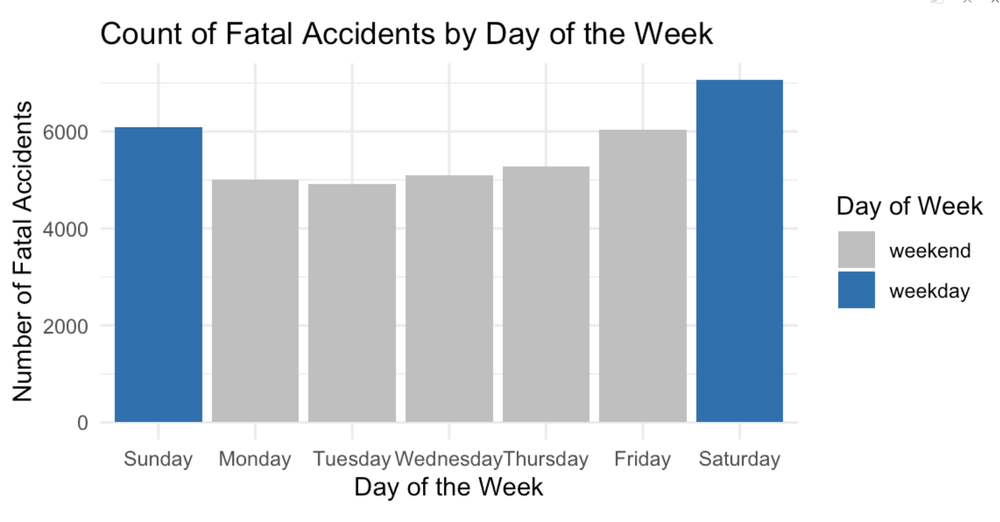
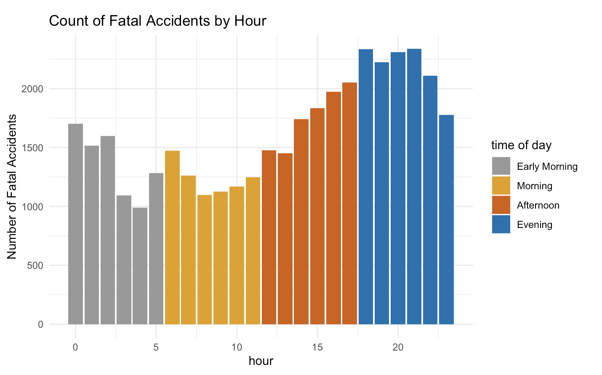
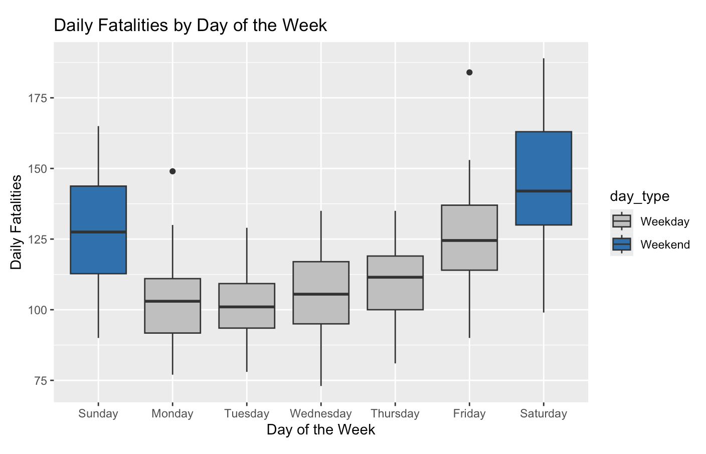

# Abstract 

Motor vehicle accidents are the leading cause of unintentional injury-related deaths in the U.S., claiming thousands of lives each year. In our quest to understand the underlying causes of these fatal accidents, we've embarked on a deep exploration of the 2022 Fatality Analysis Reporting System (FARS) dataset. This project utilizes Exploratory Data Analysis (EDA) to uncover critical trends and risk factors contributing to fatal crashes across the country.

Through our journey, we aim to expose patterns within temporal, environmental, and road-related factors, with the ultimate goal of proposing strategies to minimize future fatalities and promote safer roads for all.

# Introduction

#### **Background** 

Our team was inspired to choose this topic by the very real and personal impact of road safety. Every day, thousands of people get behind the wheel, whether for work, family, or leisure, often without a second thought about the potential dangers. Yet, motor vehicle accidents remain one of the leading causes of accidental deaths in the U.S., affecting not only victims but entire communities. We saw this project as an opportunity to use data analysis to address a critical issue where our findings could contribute to meaningful safety improvements.

The 2022 Fatality Analysis Reporting System (FARS) dataset caught our attention as a treasure trove of information, offering insights into when, where, and how fatal accidents happen. From the time of day to weather conditions and emergency response times, it presented a unique opportunity to dissect the factors that contribute to these tragedies. With nearly 39,000 observations, we knew we could uncover meaningful patterns that might help policymakers, city planners, and road safety advocates build a safer future.

Our approach to this topic was rooted in a vision: that data, when thoughtfully explored, can lead to life-saving changes. By revealing patterns in accident trends and highlighting critical risk factors, we aim to provide insights that help reduce fatalities and foster safer roads for everyone.

#### **Objectives**

1. **Identify High-Risk Periods:** Analyze temporal patterns to determine when fatal accidents are most likely to occur, such as specific times of day or days of the week, and assess if there's a heightened risk during rush hours or weekends.

2. **Examine Environmental Impacts:** Investigate the influence of weather, lighting, and visibility on the occurrence and severity of accidents to understand the environmental factors contributing to fatal crashes.

3. **Evaluate Infrastructure and Road Conditions:** Assess the role of road type, urban vs. rural settings, and traffic control measures in accident outcomes to identify infrastructure-related risk factors.

4. **Track Trends Over Time:** Analyze monthly and regional trends in fatal accidents to detect increases or decreases in certain areas, informing regional and seasonal safety interventions.

5. **Analyze Emergency Response Effects:** Study the correlation between EMS response times and fatality rates to identify potential improvements in emergency services that could enhance survival chances in critical situations.

#### **Initial research questions**

The backbone of our study lies in answering the following SMART questions:

1. How do temporal factors (time of day and day of the week) influence the frequency and severity of fatal     accidents?
2. What is the relationship between weather and lighting conditions and the occurrence of fatal accidents?
3. How do road conditions (urban vs. rural, road type, and traffic controls) impact the severity of crashes?
4. Are there discernible trends in fatal accidents over time? Has there been an increase or decrease in        fatalities in certain regions?
5. How does EMS arrival time influence the outcome of fatal crashes, and are quicker response times linked     to lower fatality rates?

*These SMART questions were developed by identifying key factors that contribute to road safety and prioritizing those that could lead to actionable insights for reducing road fatalities. Each question addresses a specific element of fatal accidents, aiming to uncover patterns and risk factors that could be directly influenced by policy changes, infrastructure improvements, or emergency response optimizations.*

# Dataset Overview

This study utilized the 2022 Accidents data file from the Fatality Analysis Reporting System (FARS) by the NHTSA, encompassing nearly 39,000 fatal crashes across all 50 states, DC, and Puerto Rico.FARS compiles and reports the characteristics of vehicle collisions on public roads that result in a fatality within 30 days of the crash. Each record represents a fatal crash and includes detailed crash characteristics and environmental conditions, with key variables:

- **Temporal Factors**: Month, day of the week, and hour of the day when accidents occurred.

- **Environmental Factors**: Weather, lighting conditions, and road types

- **Location and Infrastructure**: State, urban/rural classification, road type

- **EMS**: EMS response time

- **Severity Indicators**: Number of fatalities

FARS data is collected through partnerships between the NHTSA and state governments, sourcing information from police reports, death certificates, vehicle registrations, and coroner reports, then coded and validated for accuracy. A limitation of the dataset is its focus solely on fatal accidents in 2022, which restricts analysis of trends and excludes non-fatal incidents and behavioral factors such as driver impairment or fatigue, limiting broader insights into overall road safety.

# Data Preprocessing

In our data preprocessing, we started by removing duplicate rows and dropping columns that were either irrelevant or duplicated. Next, we standardized column names for consistency and converted several variables into factors to represent categorical data properly. This ensured our dataset was clean and ready for analysis.

# Analysis and Results

## 1. Temporal Analysis
### 1.1 Exploratory Data Analysis

#### Overview of Total Accidents and Fatalities
##### Day of Week

The averages are 5,640 accidents and 6,112 fatalities. Saturdays have the highest counts (7,057 accidents, 7,735 fatalities), while Tuesdays have the lowest (4,914 accidents, 5,292 fatalities), indicating weekends are riskier.

##### Hour of Day

The frequency graph shows fatal accidents decline from midnight to 6 AM, remain low until noon, peak at 6 PM, and slightly decrease after 9 PM. The averages are 1,632 accidents and 1,769 fatalities. The highest counts occur from 6–10 PM, while the lowest are at 3–4 AM and 8–10 AM, reflecting a consistent daily pattern.

#### Daily Fatalities

The boxplot reveals higher and more variable median fatalities on weekends, especially Saturdays, compared to consistent lower counts on weekdays.

## 1.2 Research Questions and Hypothesis Development

### Research Questions

Our EDA revealed daily patterns in accidents, prompting us to group hours into four time periods: early morning, morning, afternoon, and evening. These observations refined our focus on how time periods and days of the week influence accident frequency and severity, categorizing severity into "one" and "multiple" fatalities due to distribution imbalances.

The EDA suggests that weekends and evening hours have higher accident frequencies and fatalities, indicating a potential influence of both day and time on accident severity. Further testing will confirm these patterns, expanding on prior studies (Farmer & Williams, 2005; Weast, 2018) that identified a weekend effect using primarily descriptive analysis. 

- SMART question 1: Do **day of the week** and **time period of the day** affect the occurrence and fatalities of fatal accidents?
- SMART question 2: Does **day of the week** affect the day to day variation on total fatalities per day?

### 1.3 Hypotheses Development

To address these research questions, we formulated the following hypotheses:

**Occurrence Analysis**

- **Null Hypothesis (H0)**:  Accidents are evenly distributed across days of the week/time periods of the day.
- **Alternative Hypothesis (H1)**: Accidents are not evenly distributed across days of the week/time periods of the day.
  
**Fatality Analysis**

- **Null Hypothesis (H0)**: Fatality distribution is independent of day of the week/time period.
- **Alternative Hypothesis (H1)**: Fatality distribution depends on day of the week/time period.

**Daily Fatalities**

- **Null Hypothesis (H0)**: Mean fatalities per day are equal across all days of the week.
- **Alternative Hypothesis (H1)**: At least one day has a different mean fatality rate.

## 1.4 Statistical Tests

### Occurrence Analysis

We performed chi-squared goodness of fit tests to determine if accidents are evenly distributed across days and time periods. Results (p < 0.05) show uneven distribution, with significantly more accidents on Saturdays (18.87), Sundays (6.10), and during evenings (33.34).

### Fatality Analysis

Chi-squared independence tests assessed the relationship between accident severity and time variables. Significant associations (day: p = 0.006; time: p = 1e-05) indicate more multiple-fatality accidents on weekends, especially Saturdays, and during early mornings.

### Daily Fatalities Analysis

To compare average fatalities across days, we conducted Welch’s ANOVA due to unequal variances. The analysis (F = 42, p < 2e-16) and Games-Howell post-hoc tests reveal higher fatalities on Saturdays and Sundays, with Fridays similar to Sundays, while weekdays have lower fatalities.

### 1.5 Insights

Accidents are most frequent on weekends, especially Saturdays, and evenings. Multiple-fatality accidents peak on weekends and early mornings. Saturdays and Sundays show the highest average fatalities, followed by Fridays. These trends highlight weekends as high-risk periods needing targeted interventions.

## 2. Analysis of Envirnomental conditions 

### Bivariate Analysis and Multivariate Analysis : 

This analysis investigates the effects of weather and lighting conditions on fatal accidents, using exploratory, bivariate, and multivariate analysis techniques.

*1. performed an exploratory analysis of the dataset to examine the relationship between weather and lighting conditions and the total fatalities*

*2. Analyzed fatality counts by both weather and lighting conditions using a heatmap*

##### Overview of Weather and Lighting Effects:

1. Exploratory Analysis: We examined fatality counts by weather and lighting conditions and visualized these relationships. Missing values like "Not Reported" were filtered out to focus on relevant data.

2. Grouping and Aggregation: The dataset was grouped by weather and lighting conditions, calculating total fatalities for each.

3. Visualization: Fatalities were plotted by both weather and lighting conditions, and a heatmap was created to show their combined effects.

##### Key Findings:

1.Weather Conditions: Clear weather had the highest fatality count, likely due to higher traffic volumes and faster speeds during clear conditions.

2.Lighting Conditions: Daylight and unlit dark conditions had high fatality rates, suggesting that safety interventions could focus on these times. Improvements could include enhanced lighting in high-risk areas at night.

### Location based Analysis :

We identified the top 10 U.S. states with the highest fatal accidents under adverse weather and poor lighting conditions. States like Florida and Texas topped the list, indicating potential areas for targeted safety measures, such as better lighting, signage, and public awareness during severe weather.

Steps carried out:

1. Filtering for Adverse Conditions
2. Aggregating Fatalities by State
3. Selecting the Top 10 States
4. Creating a Bar Plot where each bar represents a state, ordered by the total fatalities

### **Hypothesis Testing**

**Null Hypothesis H0**: There is no difference in the mean number of fatalities between adverse and clear weather conditions.

**Alternative Hypothesis H1**: There is a difference in the mean number of fatalities between adverse and clear weather conditions. 

1. Two-Sample t-Test (Weather Conditions):

Objective: To compare fatalities between adverse and clear weather conditions.

Results: The t-statistic of -5 and a p-value of 1e-05 led to the rejection of the null hypothesis, concluding that clear weather conditions have significantly higher fatalities than adverse ones. Mean fatalities were 62.3 for adverse and 359.4 for clear weather.

2. ANOVA and Post Hoc Test (Lighting Conditions):

Objective: To assess differences in mean fatalities across lighting conditions.

Results: The ANOVA yielded a p-value of 0.0017, indicating significant differences. The F-statistic (3.52) suggested that lighting conditions influence fatality rates. Tukey's HSD test revealed that "Dark - Not Lighted" had significantly higher fatalities than "Dark - Lighted" (p-value 0.001).
Practical

### Practical Implications :

Recommendation: Improving lighting in areas that are "Dark - Not Lighted" may help reduce fatal accidents, as lighting seems to play a crucial role in accident prevention under dark conditions.
For other lighting conditions, the lack of significant differences suggests that fatalities do not vary considerably across these conditions. This could imply that lighting in conditions like Dawn, Daylight, and Dusk might be sufficient, and improvements in these areas may not have as strong an impact on reducing fatal accidents.

## 3. Analysis of Infrastrcture conditions

**Overview on the effect of road conditions (urban and rural, road type) on the severity of crashes**

- The steps involved include data cleaning to handle any missing or inconsistent values especially in the "urban" and "rural" features and transforming the dataset to ensure accurate categorization of road types. Next, the data was aggregated to calculate the total number of fatalities for each road type. Visualizations were then generated to gain insights into patterns and trends, particularly identifying which road types experience higher fatality rates. 

- Next, the data was grouped by both route type and functional system to capture the distribution of crash frequencies. Aggregations were performed to count crashes by each functional system within route types, followed by visualizing the data to identify patterns in crash occurrences across different functional road systems. The visualization provided insights into which routes and road classifications contribute most to crash frequencies, aiding in targeted road safety measures and policy-making.

- A heatmap was then selected for visualization to emphasize areas with high crash densities. The result highlights the critical intersections between route types and functional systems, aiding in identifying which combinations are most associated with crash occurrences and warrant further investigation or safety interventions.

#### Bivariate Analysis : 

1. **Total Fatalities by Road Type** - 

Purpose: This bivariate analysis helps us understand the relationship between road type and fatality frequency, highlighting which road types experience higher fatality counts.

Insights: 

- High Fatality Counts on Certain Road Types:

"Principal Arterial - Other" has the highest number of fatalities (6,486), followed by "Minor Arterial" (5,140) and "Major Collector" (4,346).
These road types are likely major thoroughfares or heavily trafficked routes, which might contribute to the higher fatality counts.

- Potential Factors:

The high fatality counts on "Principal Arterial - Other" and similar road types could be due to factors such as higher speeds, heavier traffic, or design characteristics that may increase accident severity.
Conversely, the lower counts on "Minor Collector" and "Local" roads may result from lower speed limits and traffic volumes, which generally correlate with fewer and less severe accidents.

- Targeted Policies:
With evidence that fatalities cluster on certain road types, policies could be customized. For example, highways might benefit from median barriers and crash cushions, while local roads might benefit from better lighting and pedestrian crossings.

2. **Top Routes and Functional Systems by Crash Frequency** - This is also a bivariate analysis, showing the relationship between route name and functional system in terms of crash frequency.

Insights : 

- It reveals the crash frequency for various functional systems (e.g., "Interstate" or "Principal Arterial - Other") within specific routes, which can help identify which combinations are associated with higher crash risks.

- High Traffic Volume Routes are High-Risk: Routes like State Highway, US Highway, and Interstate show high crash frequencies, likely due to high traffic volume and higher speeds. This suggests that major highways and state routes may need targeted safety interventions to manage these risks effectively.

- Diverse Functional Systems on Certain Routes: The presence of multiple functional systems (e.g., Principal Arterial and Minor Arterial) on State Highways and Local Streets indicates that these roads experience varied traffic conditions, which could contribute to higher crash risks.

Potential for Safety Interventions:

State and US Highways could benefit from interventions such as speed control measures, improved signage, and roadway design enhancements. Local streets and county roads, while having fewer crashes overall, may still need safety measures, especially in urban areas with pedestrian traffic.

3. **Comparison of Average Crash Severity and Crash Frequency by Area Type (Urban vs. Rural) Across Functional Road Systems** 

These plots help us understand two key aspects of road safety:

- Crash Severity: Whether crashes in rural or urban areas tend to be more severe for each road type.
- Crash Frequency: How frequently crashes occur in rural versus urban areas for each road type.

Insights :

Both rural and urban areas show similar average crash severity levels, indicating that crash severity on interstates does not vary significantly between these area types. This finding suggests that, while the location (urban or rural) may influence factors like crash frequency, it may not significantly impact the severity of crashes on interstates specifically.

#### **Statistical tests**

#### **Hypothesis testing** 

- Null Hypothesis (H0)
There is no significant difference in the distribution of fatalities across different road types. 

- Alternative Hypothesis (H1)
There is a significant difference in the distribution of fatalities across different road types. This means that fatalities are not uniformly distributed across road types, suggesting that some road types are more prone to fatalities than others.

#### 1. chi-square test on the effect of road types 

This test helps us determine if fatalities are unevenly distributed across different road types, which would suggest an association between road type and fatality likelihood. The results show a chi-square value of 18,848 with a p-value of <2e-16, which is far below the typical significance level of 0.05. Given this low p-value, we reject the null hypothesis and accept the alternative hypothesis. This implies that the distribution of fatalities differs significantly across road types, and certain road types are indeed associated with higher fatality counts.

### 4. Analysis of Trends in Fatal Accidents

This section addresses the research question: Are there noticeable trends in fatal accidents throughout the year 2022, and has the number of fatalities increased or decreased in certain regions?

This report examines trends in fatal accidents across the United States using data from the 2022 Fatality Analysis Reporting System (FARS). The goal is to identify notable temporal and regional patterns in fatal accidents, as well as to uncover key contributing factors to these tragic events. By exploring patterns across time, environment, and location, we aim to provide actionable insights for policymakers and public safety officials seeking to mitigate fatalities on U.S. roads.

### 4.1 Monthly Fatality Trends

The analysis began with an exploration of fatalities by month to understand if there were any seasonal or monthly variations. The data reveals that certain months, particularly the summer months of July and August, experience higher rates of fatal accidents. 
This increase could be attributed to higher travel volumes during summer vacations, warmer weather encouraging more road travel, or potential lapses in driver vigilance during extended holiday periods. A boxplot visualizing fatalities by month underscores this seasonal trend, showing a clear uptick in the number of fatalities during these months.

### 4.2 Geographic Patterns of Fatalities

A state-level analysis of fatalities uncovers significant regional disparities in fatal accident rates. Highly populated states such as Texas, Florida, and California register the highest number of fatalities, a trend that could correlate with larger population densities, extensive road networks, and heavier traffic flows in urban areas. The visualization of fatalities by state highlights these areas as high-risk regions for fatal accidents, suggesting a need for region-specific interventions to address the unique challenges posed by high traffic volumes and urban congestion.

Further, comparisons reveals that fatal accidents in rural areas tend to be more severe. Rural roads may contribute to higher accident severity due to factors such as increased driving speeds, fewer road safety features, and delayed emergency response times. Rural fatalities are likely compounded by limited healthcare access and distance from emergency medical services, suggesting that improving rural infrastructure, such as lighting and emergency services, could help reduce the severity of accidents in these areas.

### 4.3 Statistical Analysis and Hypothesis Testing

To statistically validate these observed trends, an Analysis of Variance (ANOVA) test was conducted on monthly fatalities. The ANOVA results indicate significant differences in the mean number of fatalities across months, supporting the hypothesis of seasonal variation in fatal accidents. In particular, the months of July and August stand out as periods with notably high fatalities, reinforcing the idea that summer months are high-risk periods. Similarly, an ANOVA test examining regional variations in fatalities confirms that certain states have significantly higher fatality rates, underscoring the need for state-targeted road safety campaigns and policy measures.

### 4.4 Recommendations

The findings from this report suggest several policy directions to help mitigate fatal accidents. First, a focus on seasonal awareness campaigns could prove beneficial. For instance, promoting driver safety and awareness in the months leading up to and during high-risk periods such as summer and major holiday seasons could help reduce accident rates. Additionally, the results point to the importance of improving rural infrastructure, particularly in high-fatality states. Enhanced road lighting, signage, and faster emergency response capabilities in rural areas could address some of the most critical factors leading to severe accidents outside of urban centers.

Further, state-specific road safety measures could play a crucial role in addressing the unique road safety challenges in densely populated areas. For example, implementing stricter speed limits, increasing enforcement of traffic regulations, and enhancing road safety features in high-risk states like Texas and Florida may lead to a reduction in fatal accidents.

### 4.5 Limitations and Future Research for this question.

While this report provides valuable insights into 2022 fatal accident trends, the analysis is limited to a single year of data, preventing any long-term trend analysis. Expanding future research to include multi-year data would enable a more comprehensive understanding of changes over time and allow for a deeper exploration of the impact of policy measures. Additionally, incorporating behavioral data, such as driver impairment or fatigue, could further clarify the underlying causes of fatal accidents and enhance targeted interventions.

In conclusion, this analysis underscores the importance of seasonal, regional, and rural-specific interventions to reduce fatal accidents across the United States. By targeting high-risk times and locations with strategic policy initiatives, public safety officials can take significant steps toward safer roadways and a reduction in fatalities nationwide.

### 5. Influence of EMS Arrival Time on Fatality Severity

How does the EMS arrival time influence the severity of fatal outcomes?
This question focuses on examining how the response time of Emergency Medical Services (EMS) correlates with the severity of fatal accidents. Using the Fatality Analysis Reporting System (FARS) dataset for 2022, the analysis aims to understand whether faster EMS arrival times result in lower fatality severity. The severity of accidents is categorized based on the number of fatalities, and the relationship between EMS arrival time and these severity levels is explored through descriptive statistics, data visualization, and statistical testing.

### 5.1 Descriptive Analysis

Initial descriptive statistics reveal variability in EMS arrival times across different accident severity levels. The average arrival time was generally lower for accidents with fewer fatalities, suggesting that quicker responses might correlate with reduced severity. Further, accidents with "Very High" severity (6+ fatalities) showed a higher average EMS arrival time, indicating that delays in response could be associated with more severe outcomes. This trend warrants a deeper look through visualization and statistical analysis.

### 5.2 Visual Analysis

To visualize the relationship between EMS arrival time and accident severity, box plots and scatter plots were generated. Box plots of EMS arrival times across severity levels illustrate that higher-severity accidents often experience longer EMS response times. Scatter plots further display a positive trend between EMS arrival times and the number of fatalities, with severity levels clearly delineated. These visualizations suggest that delays in EMS response might exacerbate the fatality count, especially in severe accidents.

### 5.3 Statistical Analysis

To quantify the relationship between EMS response times and fatality severity, an Analysis of Variance (ANOVA) test was conducted. The ANOVA results indicated significant differences in EMS arrival times across severity levels, reinforcing the visual trends observed. The findings imply that, on average, longer EMS response times are associated with higher fatality counts. This relationship was further supported by a post-hoc Tukey test, which identified significant differences in EMS arrival times between lower and higher severity categories.

### 5.4 Policy Implications

The analysis suggests that EMS arrival time is a critical factor influencing fatality severity in road accidents. Higher severity levels tend to correlate with longer EMS response times, emphasizing the potential life-saving impact of quicker emergency response. Based on these findings, policy recommendations include:

Investment in EMS Resources: Increasing the availability of EMS units in high-risk areas could reduce response times and potentially lower fatality counts.

Enhanced EMS Infrastructure in Rural Areas: The data suggests that rural accidents often experience longer response times. Improving infrastructure to support faster EMS access in these areas may mitigate severe outcomes.

Technology Integration: Implementing real-time traffic management and accident alert systems could enable EMS to navigate to accident sites more efficiently, reducing response times.

### 5.5 Limitations and Future Directions

This study is limited to 2022 data, restricting the ability to observe long-term trends. Future research should incorporate multiple years of data to evaluate whether improvements in EMS response times correlate with reduced fatality severity over time. Additionally, investigating other factors such as weather conditions and road types may further clarify the nuances of EMS impact on accident outcomes.
 ​​

# Conclusion

Fatal accidents are most frequent between 6 pm and 10 pm, particularly on weekends, with late-night hours linked to increased severity. Highways and major arterials report the highest number of fatalities, possibly due to higher speeds and traffic volumes. Clear weather conditions are associated with a higher rate of fatalities, while poorly lit roads also present elevated risks. EMS response times did not significantly impact accident severity, suggesting that preventive safety measures should be prioritized over emergency response.

Given these findings, targeted interventions should address high-risk periods, such as evenings, late nights, and weekends, with a focus on speed control and improving road lighting.

The dataset's limitations, such as its focus only on 2022 fatal accidents and the lack of behavioral data, limit the analysis of broader safety trends and contributing behavioral factors. Future research should include year-over-year comparisons and incorporate behavioral data, such as impaired driving or fatigue, for a more comprehensive understanding of accident dynamics. Additionally, integrating temporal, environmental, and infrastructural factors to explore their interactive effects could further enhance road safety insights.

# References
Farmer, C. M., & Williams, A. F. (2005). *Temporal factors in motor vehicle crash deaths*. *Injury Prevention, 11*(1), 18–23. https://doi.org/10.1136/ip.2004.005439

National Highway Traffic Safety Administration. (2024). *Overview of Motor Vehicle Traffic Crashes in 2022*.

Weast, R. (2018). *Temporal factors in motor-vehicle crash deaths: Ten years later*. *Journal of Safety Research, 65*, 125–131. https://doi.org/10.1016/j.jsr.2018.02.011
